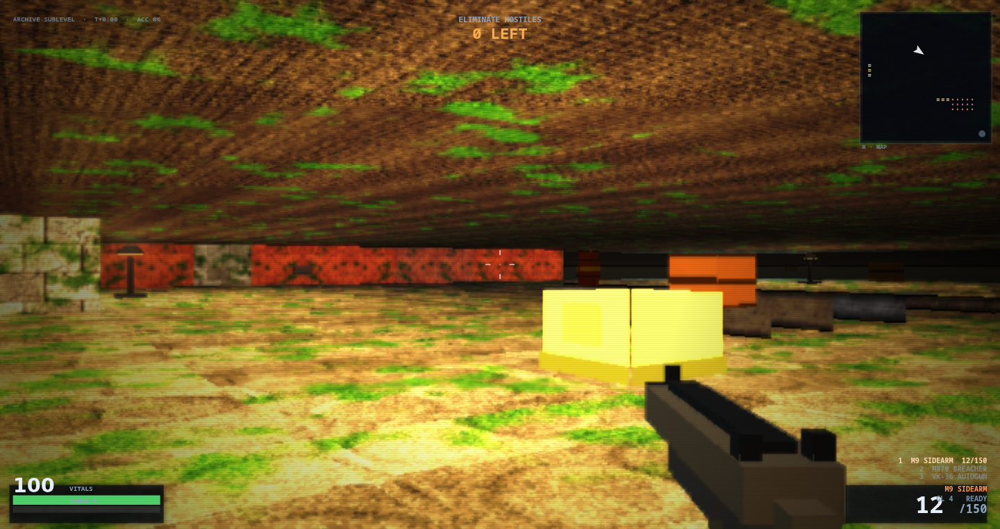
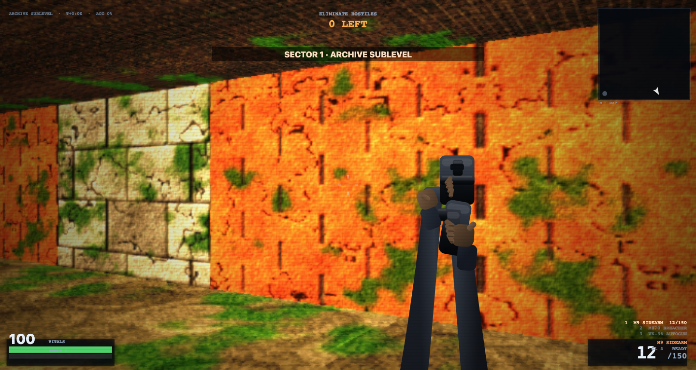
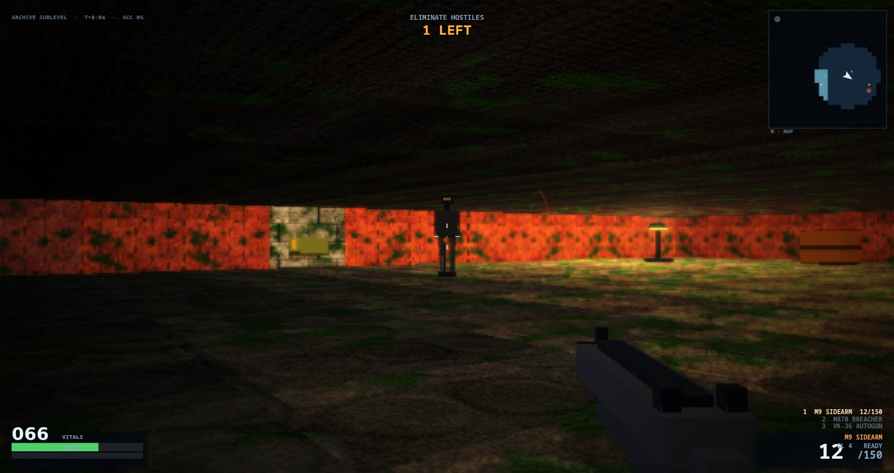
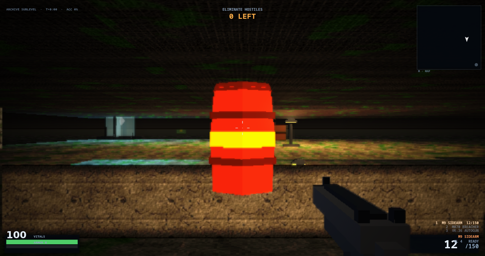
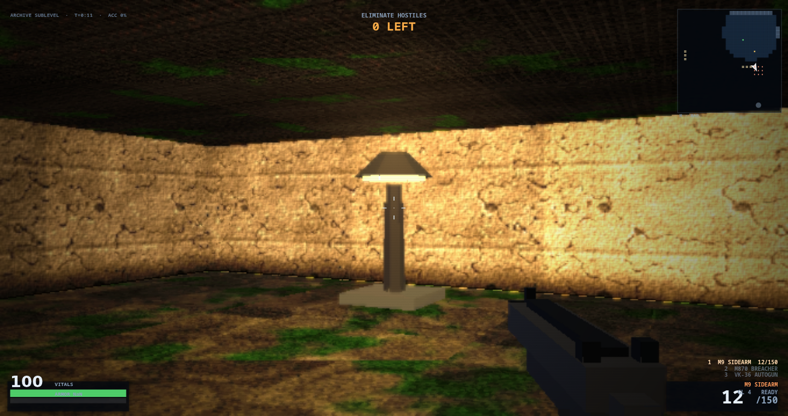

# BREACH PROTOCOL — browser FPS, zero dependencies

**Run it:** double-click `index.html` (or drag it into a browser window). No server, no build, no
internet, no assets — everything (geometry, textures, sprites, sound) is generated at boot.
[Live site](https://lioreshai.github.io/breach-protocol-flash-next/).

```
fps/
  index.html        <- click this
  js/00_core.js     utils, canvas, state, synthesized audio
  js/05_paint.js    software rasteriser + noise/SDF kit every asset is painted with
  js/10_assets.js   material baker: albedo -> normals -> cavity AO -> light, per texture
  js/11_rig.js      characters as jointed geometry, rasterized at draw time and cached by pose
  js/12_sprites.js  props and decals painted per frame from primitives
  js/13_mesh.js     the bodies that actually ship: enemies and the first-person model
  js/20_level.js    room/corridor level generator, height grid, RGB lightmap, decals, occupancy
  js/30_entities.js weapons, player, enemy AI, projectiles, particles
  js/40_render.js   software raycaster + post FX + 2D overlay/HUD
  js/50_ui_input.js menus, pointer lock, input, main loop
  js/90_dev.js      the ?dev=1 console (inert without the flag)
  tools/smoke.js    headless pass/fail harness (node tools/smoke.js; VERT=1 adds the vertical lane)
  tools/view.js     headless visual harness — see "Judging the picture without a browser"
  tools/png.js      minimal PNG writer used by view.js (no dependencies)
  tools/recap.js    capture-caption table decoded from docs/screens/*.png, and the
                    README-vs-the-files gate: node tools/recap.js check
```

## Controls
| | |
|---|---|
| `W A S D` / arrows | move |
| mouse | look (pointer lock; click the window to grab the mouse) |
| left click | fire · hold for auto weapons |
| right click | aim down sights (tighter spread, zoom) |
| `Shift` / `C` | sprint / crouch (crouching lowers your profile under incoming fire) |
| `Space` | jump |
| `R` | reload · `1 2 3` or mouse wheel | weapon select |
| `G` | grenade (area damage, chain-detonates barrels) |
| `Esc` | pause · `M` map · `T` sound · `F3` perf readout |
| `F4` | cycle quality: PERFORMANCE / BALANCED / ULTRA (resolution, bloom, grain, fog depth, rig authoring size) |

## Goal
Three procedurally generated sectors. Clear every hostile, the exit portal opens, then find it.
Kills can drop health/ammo. Barrels detonate when shot. Headshots count double-plus.
Difficulty changes enemy damage, health and count.

## How it looks

Captured from the build on `main`, not from a mockup or an older build, and refreshed by any merged
PR that changes the picture. `node tools/recap.js check` decodes these files and gates the numbers
quoted below against them, so a caption cannot drift from its image. What *changed* between two
recaptures is a question for `CHANGELOG.md` and the PR that moved it — it is not kept here.

The five frames decode to **87.53 / 23.05 / 87.45 / 31.05 / 139.46** mean luma
(`0.2126 R + 0.7152 G + 0.0722 B`, the rule `DEV.lum` uses), in the order they appear below.



The datum floor under a lamp, which is the exposure the tonal gates are tuned against:
**0 of 763 rows average below luminance 24**. Nothing here is off-band, so this is the frame that
has to stay bit-identical when a height term is added — `flatparity`'s backwards-compat senses.



Four risers up to a raised band.
**467 of 763 rows average under luminance 24 and the longest unbroken run is 245 rows, starting at row 0** —
that run is the unlit volume above the band, and it is the honest shape of the open problem: the
grid is multi-storey and there is nothing authored to look up into
(see [`docs/VERTICALITY.md`](docs/VERTICALITY.md), M4/M5).



One posed grunt at 6 m on the camera's own band. Bodies are meshes from `js/13_mesh.js`; the
silhouette-separation debt against a busy wall is issue #17.



The pit lip from three metres out, lit by a lamp standing in the pit.
**370 rows average under luminance 24 here and the longest unbroken run is 301 rows from row 0.**
The lamp lights the pit floor and not the lip above it, which is the band gate in `splatLight`
admitting light per run of a scanline by the band of the surface the pixel shows.



Standing in the hole, inside the lamp's own cell — the brightest frame of the five, and the one
that shows the glow working from inside the band it refuses from above.

## How it works
* **Renderer** is a software raycaster (Wolfenstein-style DDA) writing into an `ImageData`'s
  `Uint32Array` at ~0.5× resolution, upscaled to the window. Per-column light, fog and tint are
  computed once per column, so each pixel costs one texture read, a few multiplies and a clamp.
* **Height** is a quantized per-cell grid (`ZQ = 0.25`), one playable band per column. The ground
  pass solves each pixel against the plane of the cell its own ray lands in, and collapses to the
  flat arithmetic bit for bit on a level with no altitude. Design:
  [`docs/VERTICALITY.md`](docs/VERTICALITY.md).
* **Billboards** (props, pickups, projectiles, portal) are depth-tested per pixel against the
  distance the ground and wall passes wrote, and alpha blended, so a sprite is occluded correctly by
  walls and by the bodies in `js/13_mesh.js`, which write into that same depth. They also get a
  small distance-based fill light, so an unlit prop is still a readable silhouette.
* **Pitch** is a screen shear, so it is converted to a ray slope (`aimPx / BH`) for hit maths —
  aim at legs or head and the hit test agrees. Firing recoil is a separate term that settles on
  its own, so the vertical aim you set with the mouse is never pulled back to level.
* **Hitscan** is analytic (ray vs. enemy cylinder) rather than marched, so a shotgun blast costs
  almost nothing. A riser is a drawn face, not a solid cell, so it reports as a wall hit.
* **Levels** are rooms + L-corridors with flood-fill validation: unreachable space is rejected,
  and enemy spawns are nudged onto reachable cells so a sector can never become unwinnable.
* **Enemies** are state machines (sleep → chase → windup → melee/ranged) with line-of-sight,
  last-known-position tracking, wall sliding, side-stepping when blocked and separation steering.
  They cross bands: a staircase, a ramp or a ladder all let one climb; a raised band with no climb
  bit stops it.
* **Audio** is pure WebAudio: filtered noise bursts + oscillator sweeps, stereo-panned by the
  angle to the source, plus an ambient drone bed that thickens as you take damage.

## Tuning knobs
`js/00_core.js` → `cfg` (FOV, eye height, mouse sens), `js/30_entities.js` →
`WEAPONS` / `ETYPE` (damage, fire rate, enemy stats), `js/20_level.js` → `LEVELS` (map size, room
count, spawn tables, `amb`, `lampCol`, `fogCol`). Quality presets are the `QUAL` table in
`js/40_render.js`. `LEVELS[].rooms` is a target, not a promise — the placement loop keeps whatever
it fits, so expect 4-6 rooms on any sector.

## Driving the game from a console (dev mode)

Append **`?dev=1`** to the URL and the game boots itself — no click, no pointer lock — and publishes
one global, `DEV`. Without that flag `js/90_dev.js` returns immediately: no globals, no wrappers, no
behaviour change, so the flag cannot leak into normal play. `DEV.help()` prints this list.

| Call | What it does |
|---|---|
| `DEV.boot()` | Starts the run through the deploy button's own code path. |
| `DEV.cam(x, y[, z, ang, pitch])` | Parks camera and player. `ang` is `P.ang` (radians, +x is 0). Rejects NaN; a position inside a solid cell is snapped out. |
| `DEV.look(dAng[, dPitch])` | Rotates in place. Never feeds `mouse.dx`, so it cannot walk the player into the void. `dPitch` is in **pixels**. |
| `DEV.face([enemy])`, `DEV.nearestEnemy()` | Aim at the nearest living enemy, or a given one. |
| `DEV.freeze([bool])` | Stops `update()` and pins the clock; rendering continues, so two screenshots of "the same frame" really match. |
| `DEV.tick([n])` | Exactly `n` update+render frames at `dt = 1/60`, no vsync. |
| `DEV.spawn(kind[, n, dist])`, `DEV.clear()` | Place `grunt\|hound\|brute` in a deterministic fan `dist` metres ahead; clear entities. |
| `DEV.set(name, value)` | Runtime overrides of the quality tier (`res, bloom, grade, grain, far, glow, rigH, rast, dmax, scan, vec, min, max`). |
| `DEV.tiers()` / `DEV.stats()` | The `QUAL` table as it stands; frame ms (`n/med/p95/last`), fps, buffer, draw calls, poses rasterised, `RIG.stats`. |
| `DEV.state()` | JSON-safe snapshot: player (heading under `ang`), level, enemies, counts, `S` flags. |
| `DEV.ray(x, y[, z], dx, dy, dz[, maxD])` | Steps the real DDA and reports the first wall: distance, cell, face. |

```
DEV.boot(); DEV.cam(4.5, 4.5, undefined, 0.6); DEV.freeze(true); DEV.tick(30)
DEV.spawn('brute', 1, 2); DEV.face(); JSON.stringify(DEV.stats())
DEV.ray(P.x, P.y, 0.5, Math.cos(P.ang), Math.sin(P.ang))   // is that wall actually there?
```

Three gotchas, each of which cost a verification pass:

- **Aiming by console needs `mouse.down` too** — `update()`'s look step is gated on
  `S.locked || mouse.down` (`js/30_entities.js:326`), and `?dev=1` never holds pointer lock.
- **`DEV.ray` takes a vector**, `ray(x, y, z, dx, dy, dz, maxD)`. Calling `DEV.ray(0, 1.2)` reads
  as "pitch this ray up" and is actually a DDA starting *at cell (0, 1.2)*, which answers
  `hit: false` for a ray that hits a face at 23.5 m — an answer that agrees with whatever
  `hitscan` says and so cannot be falsified. Its `through` field annotates the ray's altitude
  against the face's span; it is not a second verdict on the hit.
- **`P.pitch` is in pixels**, clamped to `±BH * 0.62` and converted by `pitchTan()` — it reads
  222.58 where the shot's slope is 0.628. Report `pitchTan()` when a number has to mean slope.
- **`DEV.set('rim', false)` is a dead switch.** Bodies became meshes in #72 and nothing in the
  draw path calls `RIG`, so the toggle moves no pixel. Use `TINT=k` to A/B body shading.

## Judging the picture without a browser
`node tools/view.js <mode>` renders headlessly through the same code paths, with no canvas pixel
access (the stub throws on `getImageData`, so assets cannot accidentally depend on one). The full
catalogue and what each mode gates is in [`docs/DEVELOPMENT.md`](docs/DEVELOPMENT.md); the common
ones:

| mode | what it tells you |
|---|---|
| `sheets` | every material (4 tiled quads) and sprite in one PNG (`/tmp/fps_tex.png`) |
| `stats` | per texture/sprite: mean, deviation, neighbour gradient, coverage, emissive count, average RGB, blown pixels |
| `exposure` | mean luminance over levels × seeds × 6 view angles, as medians of seeded rolls, with recorded rows |
| `scene <level> [cam]` | one frame as a PNG (`/tmp/fps_scene.png`) plus its luminance stats; `WARM=1` stresses the rig cache |
| `alt`, `heights`, `cull`, `sight`, `drop`, `planes`, `decal` | the vertical suite — bands, planes, occlusion, climbs, mark windows |

`REPS=n` and `ONLY=W1` narrow runs, `ASCII=1` prints text instead of a PNG, `OUT=` redirects the
path. Levels lay themselves out with `Math.random`, so `exposure` seeds it: one seeded roll at one
fixed pose is a view class, not a property of the level — measured 21 to 137 composited mean across
five spawn frames of one level (#155), which straddles both failure anchors. That is why both
brightness assertions read the **median** of seeded rolls and print the per-roll values.

## How work is tracked

Backlog, bugs and milestones are
[GitHub issues](https://github.com/lioreshai/breach-protocol-flash-next/issues), not lines in a
markdown file — an issue can be linked from the commit that closes it and a paragraph cannot.

* A PR body names its issue with `Closes #N` (or `Fixes #N`). **The keyword is required**: on a
  squash merge a bare `#13` links the issue and leaves it open forever. The `issue` check enforces
  it. `[no-issue]` is the opt-out, like `[no-changelog]`.
* `triage.yml` runs weekly and reports open issues with no priority or area label. It reports; it
  never labels or closes anything.
* [`docs/ROADMAP.md`](docs/ROADMAP.md) keeps direction, the priority rubric and measured
  constraints. Status questions go to the tracker.

## Notes
* Chrome/Safari/Firefox all fine. Mouse look needs pointer lock, granted on the first click — that
  click does not also fire your weapon.
* On a hidpi display the renderer caps device pixel ratio at 1.5 and renders at ~34-62% window
  height depending on the preset, which keeps it at 60fps on integrated graphics.
* Boot spends ~1.6 s baking materials and characters, once, before the menu draws.
* Crates and barrels are decoration, not cover — nothing but walls is solid, so sprites never
  block movement or line of sight.
* Sound is synthesised at call time in `SND` (`js/00_core.js`). `T` toggles it and prints AUDIO ON
  / AUDIO MUTED, which is how you tell a muted game from a broken one. A throwing `AudioNode` call
  disables sound and closes the context rather than propagating: an exception in `frame()` used to
  abort before `renderWorld()`, so the simulation kept stepping behind a still picture.

## Extending it
* **A material**: add an entry to the material list in `js/10_assets.js` and paint it with the
  `Surf` primitives from `js/05_paint.js`. Levels pick wall textures through `pickWallTex`; floor
  and ceiling variants are indexed by the same ids. Never read canvas pixels.
* **A prop**: paint it into `PROP` in `js/12_sprites.js`. Billboards are drawn, filtered and
  occluded for free.
* **An enemy species**: add an `ETYPE` row (speed, `stride`, `gait`, scale, hitbox height) plus a
  `RIGSPEC` entry and `RIGCOL` colours. Rig units are fractions of body height, so hitboxes and
  geometry cannot drift apart. Gait phase advances with *distance travelled*, so a planted foot
  never slides — drive `stepPhase` the same way.
* **A quality knob**: add the field to every row of `QUAL` and read it once in `setGfx`, or in the
  shader that owns it. Never branch on the preset index inside a pixel loop.
* **Verify** with `node tools/smoke.js`, then whichever probe covers the change. Budgets: raster
  under 16 ms/frame, assets under 40 MB, and the exposure rows green.

## What the gates actually measure
`tools/smoke.js` is the pass/fail harness. Most `tools/view.js` probes print rather than fail, but
that is no longer uniform — `alt`, `heights`, `contrast`, `cull`, `sight`, `decal`, `exposure` and
`flatparity` carry verdicts and exit codes, and `ci.yml` runs a blocking subset. Read
`docs/DEVELOPMENT.md` for which is which, and three numbers honestly:

* **The raster figure is a floor, not gameplay cost.** It is `renderWorld()+renderOverlay()` on a
  frame with nobody in it, and since #185 the first-person rig rasterizes *inside* `renderWorld`,
  so that floor now includes the viewmodel. Gameplay cost is what
  `WARM=1 node tools/view.js scene 1 0` measures over 180 frames.
* **Asset memory** walks `WALLS`, `PROP`, `ENEMY`, `FLOORS`, `CEILS`, `DECAL` **and** the rig cache.
  Before that it quoted a figure for ~30% less than the game held.
* **Exposure varies a lot per level**, so the mean is a dial to tune against, not a target. Read
  `exposure`'s recorded medians rather than any number written here.

Two traps that will bite a contributor:

* `js/11_rig.js` is the one file **without** `'use strict'` and relies on implicit globals
  (`cache`, `frame`, `nearest`, `raster`, `CAP`, `BUCKETS`). Adding the directive breaks the game.
* The `vm` harnesses stub `AudioContext` as undefined, so **no sound is ever built in `view.js` or
  `smoke.js`** — an audio change cannot be verified with them. `node tools/ci/assert.js audio`
  drives every `SND` method through its own `OfflineAudioContext` and measures the waveform (#157);
  it gates CI.

More for whoever is editing here: [`AGENTS.md`](AGENTS.md) (the working agreement),
[`docs/`](docs/README.md) (roadmap, release process, engineering traps, the verticality design).
