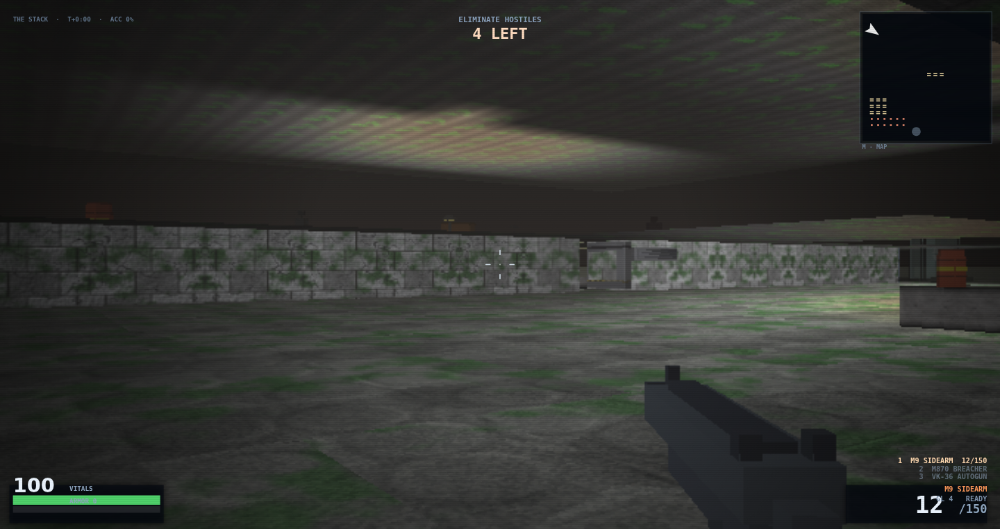

# BREACH PROTOCOL — browser FPS, zero dependencies

**Run it:** double-click `index.html` (or drag it into a browser window). No server, no build, no
internet, no assets — everything (geometry, textures, sprites, sound) is generated at boot.
[Live site](https://lioreshai.github.io/breach-protocol-flash-next/).

```
fps/
  index.html        <- click this
  js/00_core.js     utils, canvas, state, synthesized audio
  js/05_paint.js    software rasteriser + noise/SDF kit every asset is painted with
  js/10_assets.js   material baker: albedo -> normals -> cavity AO -> light, per texture
  js/11_rig.js      characters as jointed geometry, rasterized at draw time and cached by pose
  js/12_sprites.js  props and decals painted per frame from primitives
  js/13_mesh.js     the bodies that actually ship: enemies and the first-person model
  js/20_level.js    room/corridor level generator, height grid, RGB lightmap, decals, occupancy
  js/30_entities.js weapons, player, enemy AI, projectiles, particles
  js/40_render.js   software raycaster + post FX + 2D overlay/HUD
  js/50_ui_input.js menus, pointer lock, input, main loop
  js/90_dev.js      the ?dev=1 console (inert without the flag)
  tools/smoke.js    headless pass/fail harness (node tools/smoke.js; VERT=1 adds the vertical lane)
  tools/view.js     headless visual harness — see "Judging the picture without a browser"
  tools/png.js      minimal PNG writer used by view.js (no dependencies)
  tools/recap.js    capture-caption table decoded from docs/screens/*.png, and the
                    README-vs-the-files gate: node tools/recap.js check
```

## Controls
| | |
|---|---|
| `W A S D` / arrows | move |
| mouse | look (pointer lock; click the window to grab the mouse) |
| left click | fire · hold for auto weapons |
| right click | aim down sights (tighter spread, zoom) |
| `Shift` / `C` | sprint / crouch (crouching lowers your profile under incoming fire) |
| `Space` | jump |
| `R` | reload · `1 2 3` or mouse wheel | weapon select |
| `G` | grenade (area damage, chain-detonates barrels) |
| `Esc` | pause · `M` map · `T` sound · `F3` perf readout |
| `F4` | cycle quality: PERFORMANCE / BALANCED / ULTRA (resolution, bloom, grain, fog depth, rig authoring size) |

## Goal
Three procedurally generated sectors. Clear every hostile, the exit portal opens, then find it.
Kills can drop health/ammo. Barrels detonate when shot. Headshots count double-plus.
Difficulty changes enemy damage, health and count.

## How it looks

Captured from the build on `main`, not from a mockup or an older build, and refreshed by any merged
PR that changes the picture. `node tools/recap.js check` decodes these files and gates the numbers
quoted below against them, so a caption cannot drift from its image. What *changed* between two
recaptures is a question for `CHANGELOG.md` and the PR that moved it — it is not kept here.

The six frames decode to **63.44 / 20.87 / 63.06 / 47.81 / 68.50 / 50.60** mean luma
(`0.2126 R + 0.7152 G + 0.0722 B`, the rule `DEV.lum` uses), in the order they appear below.

All six come from the **deployed build** at `?dev=1&seed=60`, with the clock frozen, vitals pinned at
100, the level's own hostiles cleared so each frame shows only what its caption names, and any level
banner taken down with the game's own `banner('', 0)` - a frozen clock stops the banner's timer, so a
frame entered through `startLevel` would otherwise carry its sector title card across the picture
forever. The build is proved
by a **code** marker rather than a prose one: `authorVolume.toString()` contains the shipped statement
`rooms.length >= 8 ? 3 : TALL_WANT_MIN` (#283), and `MESH.neckBand` exists (#326) - both read off the
shipped statements, and both still read on the deployed page. That pair is the identity of the
five level-0 frames, taken while the deployed build *was* **`ce9d39d`**; the page has moved past that build
since, and those five are stale by exactly that much. **One frame is newer than the other five.**
`level3-stack.png` was drawn by the build **`ed5faf4`** (#388), and the instrument is the
URL itself: headless Chromium opened the deployed page at a 1440 × 763 viewport and drove the dev hooks
there, instead of rendering a checkout over loopback and arguing from md5. The bytes were read too, and
they are recorded as a property of the **capture**, never of the tree you are reading this in: the page
that served this frame ran `index.html` `44b7f0ca` over `js/40_render.js` `7942de4b`, `js/90_dev.js`
`c36909c9`, `js/00_core.js` `ac12ee35`, `js/13_mesh.js` `f222d5ec`, `js/20_level.js` `9b24d5c4` and
`js/10_assets.js` `3f00716c`. **Nothing in this row claims the merged tree's `js/` blobs are
md5-identical to the served page's.** A docs-only PR ships whatever `main`'s renderer is at merge time,
so such a sentence is false from the moment any `js/` file lands, and it has been false on arrival three
cycles running. What is claimed instead is measured on both trees. This branch merges
`main` at **`b85a671`**, and its one `js/` difference from the capture build is `js/20_level.js`
`9b24d5c4` → `deb7e867` - #353's overlook pairing pass; `index.html` and the other ten blobs are
identical on both sides. That pass cannot reach this seat: `LEVELS[3].authored === true`, so `genLevel`
returns at the `buildAuthored` branch before the pairing pass and before `authorOverlooked`, and
`overlookPairs` is filled only inside `authorVolume`. The measurement agrees with the code - at this
caption's own seat `SEAT=1.5,2.5,0.6 node tools/view.js scene 3` prints framebuffer md5
`340f2e85989a19ea34a908dab8eefb05` at mean 49.5 on this branch's `js/`, on `main`'s `js/`, and again on a
second untouched run; `FP_DEALT=1 FP_DEALT1=3 node tools/view.js flatparity` prints dealt level 3
`4b644b164e5b63b09fc69d5fc3256971`, mean 37.2, off-datum 134/256 on both trees, which is the value
`tools/refs.lock` carries at `main`. A `cz`-only pass on *generated* levels does not reach the
hand-authored finale, so the picture beside this sentence is the one the build at `b85a671` draws and
this pass re-labelled rather than re-rendered. (Read at the merge, the deployed page serves this tree's
twelve files byte for byte - an observation about a few minutes of this afternoon, and precisely not the
basis of anything here; making that basis a gate instead of a sentence is #395's.) **The same measurement
now says the next take of this row is a capture rather than a caption.** `main` moved again while this
sentence was being written - `cd191ca`, #408 scaling an authored lamp's pool to the plan it stands in -
and that term *does* reach this seat: the identical harness and seat with `main`'s `js/` prints
framebuffer md5 `1cf43eac4ac2af7f6f1dac2a7f96ab35` at mean **48.9**, against the
`340f2e85989a19ea34a908dab8eefb05` at 49.5 this branch's `js/` prints in the same minute. So the bytes
embedded here are stale by #408 alone - a lamp one cell inside the room giving back some of the light it
was over-spilling, which is most of what this frame's brightest patch is made of - and no sentence about
md5s, honest or not, can cover that.
That take had to re-render rather than re-label, because the renderer #407 put on `main` draws this seat
differently: #407 let a body or a prop ten metres out keep the lamp field of the cell it stands in instead
of paying `exp(-d × 0.14)` of it, so the things standing in this room read brighter than they did in the
frame beside this sentence. That term is read on the deployed page rather than inferred from a changelog -
`DEV.set('bodydist', 0)` between the route and the shutter, after the frame was already frozen, brings
this seat back to the frame it replaces within the route's own noise (6,516 of 1,098,720 px over 2 luma,
worst 6.0, mean |delta| 2.42, every row-mean third unchanged to 0.01), against 11,712 px and worst 73.2
with the shipped `BODYDIST` 1 left alone; two runs of the route with no switch touched at all differ by
6,925 px at worst 6.0, which is the floor both of those are read against. `DEV.state()` prints `gnd` but
not `bodydist`, so the shipped value quoted here is the `BODYDIST` global itself, read off the page that
served this capture. Seven merged PRs have moved that seat's picture since `34d58d0` last sat here: #318 walked
the doorway lamp one cell east out of the wall jamb, #375 cancelled a lamp's borrowed light on the far
ceiling past the level's edge - in three takes, the last of them landed while this frame was being taken,
#373 turned props into shaded solids, #403 mounted fixtures on walls, #400 set them back off the wall face
so they keep a shape at an angle, #379 replaced bloom's flat gain over every mid-bright pixel with a bright
pass and one shouldered black-point lift on the room, and #407 is the one that moved these bytes. Against
the frame it replaces this one decodes **50.50 → 50.60** by thirds **41.82 / 58.88 / 50.83 → 41.82 /
59.19 / 50.82** (`tools/recap.js`'s own band means, which are what the tool prints and gates against, not
a hand-taken third). 11,712 of its 1,098,720 pixels move by more than 2 luma - 1,648 / 8,947 / 1,117 by
thirds, worst 73.2, mean |delta| over those pixels 10.89 - and 233 of them move by more than 50, all of
them inside x 644-1392 × y 328-390: the standing things in the room, at the foot of the `TECH` wall. By
row band the move is rows 317-444, 7,069 px there against the 2,552 the same bands account for in route
noise, and the one place it lands on geometry rather than on a body is rows 300-330, **38.2** there and
**38.8** here. Everything that does not stand still reads the same: the wall's own band, x 660-1295 ×
y 340-422, is 83.2 in *both* frames, as is the streaked 4.00 plane at rows 140-180, 44.7, and the lit
floor at rows 400-600 reads 64.6 in both. So the wall did not move and neither did the floor under it;
what moved is how much of a room's light something ten metres away is allowed to keep, and that is a
renderer term and not a deal term - `DEV.layoutSig()` reads the same 2733654509 on both sides and the
row-mean thirds move 0.00 / -0.31 / 0.00. Frame channels read 49.6 / 51.1 / 47.7 there and 49.8 / 51.1 /
47.7 here, so the picture is the same colour a hair brighter, not a different one. It is stored as colour type 2 (truecolour, no
alpha) like the other five; a capture that arrives as RGBA has to be put through `tools/png_rgb.js`
first, because the decoder in `tools/recap.js` reads an alpha PNG's channels in the wrong order (#394).
Its `DEV.layoutSig()` read **2733654509** at that `seed=60`, and at this head all three runs of the
documented route read that same number - the two untouched ones and the `bodydist` A/B - so these pixels
are re-takeable on the build that ships. That was not true of
the build before it, and the reason is worth keeping: the same route against the previous deployed build
read **3233039185** twice and, issued several seconds later than the route, a fourth value (1900969947),
and calling `startLevel(3, true)` twice inside one already-open page read 1730990788 and then 1523817166.
`startLevel` generates from wherever the seeded stream has reached and generation advances it, so the
number is a property of the capture *run* - how many draws the build ahead of it consumed - and not of the
URL; the signatures this seat has worn (3233039185, 2307539281, 2733654509) are such runs, not builds. The authored `MAP.fz` is
unchanged - this level's floors are written, not rolled - and what moves between them is the `MAP.cell`
half of the hash, the `pickWallTex` panel choices, which #400's fixture placement draws from a different
point in the seeded stream - so a run that lands elsewhere shows the same room and the same geometry with
different wall panels, which is what the x 660-1295 × y 340-422 band looked like in the last re-take of this
row, and is why that band is quoted twice here: 83.2 in both frames this time, and the deal did not move.
The corollary is the honest limit of this frame: the *build* it came from is the capture's, recorded
above and in `docs/screens/provenance.json`, and the md5s above prove only that capture; the deal
reproduced at this head, but nothing in the route *pins* it - two runs agreeing is an
observation, not a guarantee, and the previous build's two runs disagreed with it - so a stored frame is
only re-takeable while the stream ahead of `startLevel` happens to land where it did. Pinning that stream,
the way `tools/view.js` does at a deal, is what would make a re-take and a deal number a fact of the URL
rather than of the run (#420). The tone figures
below are `tools/recap.js` decoding the shipped bytes, which is the only reading the gate compares. One
deviation the route has to state, because it changes the deal: a page that never gets a pointer lock
pauses on the first blur and the pause overlay dims everything under it, so this capture ends with the
game's own `resume()` and one more `DEV.tick(1)`, and the harness re-reads `S.mode` immediately before it
shuts the shutter - see the row's `note`. That is also why this route runs after the page reports itself
ready rather than from a script injected at document time: injected early, the route finishes before the
first `blur`, so the page pauses again afterwards and the capture is a dimmed one.
**The five level-0 frames have not been re-taken.** They still carry the `ce9d39d` identity and the
signature below, and #373, #403, #379, #400 and #19 have all merged since - so those five describe the picture their
own build drew, not the one the deployed page draws today. `DEV.layoutSig()` for this deal is **735688443** - the same number the previous
recapture printed on level 0, and that is not staleness: the signature is FNV-1a over `MAP.fz` then `MAP.cell`,
and #283 moved *which rooms get tall air*, a `MAP.cz` write, so the floors and walls of this deal are
unchanged and only its ceilings are not. The columns you can look up in went **70 to 129** and now **174** (the deployed page's own
`MAP.cz` histogram over the 676 columns reads 502 at 4, 129 at 12 and 45 at 16): the room at
(2..9, 1..9) was already three units of air, and #283 added a second one on the raised band at
(6..12, 16..24), both at `MAP.cz` 12, together with the doorway mouths that carry that air out of the
rooms - and it reset the ceiling inside the pit. `tools/view.js volume` on this tree reads 0 of 12 deals
per level authoring no volume at all (which is what #282 was about), and its arrival row prints **0 of 12 deals show no tall column to the SPAWN SEAT** on every level
(min 18, median 18 to 54, max 85 look-up columns seen from the seat across the four sweeps, and the
seat's own headroom **4.00** on all 36 generated deals — the authored level's 12 deals read **1.00**, which
is the seat-under-a-slab geometry its own caption names). The seat looking up into four units of its own air is
#300's doing; #283 is what put tall columns in the map for that row to find. (that sweep is 12 rounds of one stream, i.e. the deal `alt`
gates plus 11 redraws; `BOOT=1` instead boots 12 separate `SEED=n` deals, which is the path that reproduces
issue #282's three) - which is why the one unit of headroom in these frames belongs to the **authored**
level's seat (the last frame below, `MAP.cz` 4 over a floor of 0.00) and not to the level-0 spawn seat,
whose own column is `MAP.cz` **16**. The sixth frame is the exception on deals too: THE STACK's `MAP.fz`
is authored and therefore identical every load, but `MAP.cell` also carries the wall-texture choices
`pickWallTex` draws (`js/20_level.js:408`), so entering that level by `startLevel(3, true)` from a fresh
`?dev=1&seed=60` boot hashes to **3084649030** while the same plan reached after other generations hashes
differently - same geometry, different panels.

Seed 60 was chosen for **feature coverage** by a sweep of the generator's first 60 seeds - longest
monotone `MAP.fz` run, straight datum-to-pit lanes, count of columns with `MAP.cz >= 8` - and this
pass re-checked that coverage on the merged build rather than re-running the sweep: level 0 still has
the five-cell flight at (1,9)→(1,13), the 3x3 sunken block at (19..21, 14..16), props to shoot at (9
lamps, 7 crates, 7 barrels) and now *more* tall air. The probes' seeds are a different deal in a
different environment - the browser's seed 12345 folds to `2229721315`, the harness's to `3367779095`,
because the two consume different numbers of draws before generation - so the coordinates below are
this deal's, and a caption that cannot name its seed cannot be re-measured.


The spawn seat (18.5, 5.5) on a lit datum floor, which is the exposure the tonal gates are tuned
against: **0 of 763 rows average below luminance 24** - there is no dark band left in this frame to count,
and its darkest third averages 44.9 against 54.0 in the middle and 91.5 at the feet.
The light here is the cell's own ambient - `MAP.light` **0.81** at (18,5), whose `MAP.fz` is 0
and whose `MAP.cz` is **16**, four units of authored air over the seat - and there is no lamp
in frame: the only prop inside the camera's ±35.75° (cfg.plane 0.72) from this seat is the red barrel at
(22.5, 8.5), 5.00 m out and 2.5 degrees off the heading, which is the drum standing centre-frame. Nothing here is
off-band, so the floor, walls and props here are still the frame
`flatparity`'s PARITY and LOCK senses hold to a literal. What moved is the ceiling: the ground
pass's per-row term (`CEILHI` 3.0, `CEILG` 1.4, `CEILGM` 0.9) is exactly 0 while a plane solves
within 3.0 of the eye - every pixel of a one-unit level - and this seat, 3.50 under a 4.00 plane,
is the first place it is allowed to do something.


Four risers in five cells: the flight at (1, 9) steps `MAP.fz` **0, 1, 2, 3, 4** up to (1,13), three of
those cells flagged `MAP.feat` STAIR, so 1.00 m of climb seen from the tread below it at (1.5, 8.5).
**488 of 763 rows average under luminance 24 and the longest unbroken run is 277 rows, starting at row 0**
(mean 20.87, band means 9.5 / 32.1 / 21.0). The reader sees the flight — lit treads stepping up the middle
of the frame to a lit floor one band higher — under **black air**: the top two fifths of the frame are dark
from row 0, and the light ceiling term that lit this camera in an earlier build does not reach it here.
That darkness is the absence of a lamp rather than a ceiling: the camera's own cell reads `MAP.light` 0.02 and the flight's 0.01 to 0.12, while the
band's cells run 0.26 → 1.20 along +y because two lamps stand ON it at (4.5,16.5) and (1.5,21.5), both
at floor +1.00. What the camera can look UP into is not the flight - (1,10)…(1,13) are one unit of air,
`MAP.cz` 4 - but the room one cell over at +x, whose columns are `MAP.cz` 12: three units of air,
through a doorway so open it draws no face at all.
That is still the honest shape of the open problem: volume is authored room by room, and a stairwell is
not a room
(see [`docs/VERTICALITY.md`](docs/VERTICALITY.md), M4/M5 and the #275 correction to what `alt` reports).


One grunt at 6 m on the camera's own band — the spawn seat, then `DEV.clear()` and
`DEV.spawn('grunt', 1, 6)`, whose arguments are `kind, n, dist`: **one** grunt **6 m in front of this
camera**, in a fan, which is why the HUD reads **1 LEFT**. It lands at (24.23, 7.27), cell
(24,7), on `MAP.fz` 0 like the camera, in a cell whose `MAP.light` is 0.13, and `DEV.spawn` pins
`e.anim` to **0**, so this is the rest pose rather than a stride: `view.js anim`'s walk-cycle rows are
what gate motion, and #274 records why a pose-domain assertion is the honest form of that claim. The
heading is 0.30 rad rather than the seat's dealt 0.60, and that is a capture fix, not a pose: on the
0.60 line the deal's barrel at (22.5, 8.5) passes 0.22 m off the ray five metres out, and the body a
metre behind it reads as a drum with an arm poking out - the first capture of this frame is that
picture. On the 0.30 line the nearest prop is 1.68 m off, so the body reads whole. Behind it, at 6.80 m,
is the busy red face that issue #17's silhouette-separation debt is about. Bodies are meshes from
`js/13_mesh.js`.


The pit lip from 2.5 m out — camera **(20.5, 11.5)**, yaw **π/2**, feet on the datum, the lip plane
exactly 2.50 m ahead — lit by a lamp standing in the pit.
**307 of 763 rows average under luminance 24 and the longest unbroken run is 251 rows from row 32** (mean
47.81). The hole
is the 3x3 block (19..21, 14..16) at `MAP.fz` **-4**, and its own `MAP.cz` is **4** - #283 resets a
pit's ceiling to one unit, so a hole that lands in a room the tall-air feature made tall stays a hole
under a lip instead of becoming a shaft. The lamp stands in it at (20.5, 16.5) on band **-1.00**, 5.00 m
from this camera (5.05 m to its own `z`). The nine hole cells read `MAP.light` 0.20 to 0.41 while column x=19 falls 0.75 → 0.41
from the spawn row down to the lip, so the pool of light in this
frame is the lamp's own band and the lip is lit by the lane - the band gate in `splatLight` admitting
light per run of a scanline by the band of the surface the pixel shows.


Standing in the hole at (19.5, 14.5), cell (19,14), heading **atan2(2,1) = 1.11 rad** so the lamp sits on
the crosshair: feet on **floor −1.00**, own ceiling **0.00**, eye
**−0.50**, `MAP.light` **0.23**. The lamp doing the work stands one cell over and two further along at
(20.5, 16.5), 2.24 m away and in this same band. **201 of 763 rows average under luminance 24 and the longest unbroken run is 175 rows from row 31**
— 68.50 mean, on a cell reading less than a third of
the spawn seat's light, which is the glow working from inside the band it refuses from above.



**THE STACK** (`#16`, M6) is the first hand-authored level, and this is its spawn seat: (1.5, 2.5) on the
datum, heading 0.60, 4 hostiles left. The seat's own cell carries a ceiling at **1.00** — you are standing
under the slab — and seven cells along the heading the plan opens into an atrium whose ceiling solves at
**4.00** over a `floor 0.00`. What crosses the middle of the frame is not that ceiling but the **wall** of
the room the seat opens into: blue `TECH` panels (this level's `wall2`, drawn by the wall pass in wall
material) with the atrium's lit floor visible above their top edge, and the 4.00 plane itself is the
streaked `ROCK` ceiling filling the upper half — a surface you cannot shoot at, over a wall you can; the
stepped glyphs on the minimap at right are the staircase that gets you up there. The lit gap at the middle
of that wall is the doorway, and the lamp lighting it now stands one cell inside the room: it used to stand
in the doorway cell itself, in a wall jamb, where its own collision ghost left about 0.34 m of passage and
wedged a body in the one place the level connects (#318). The pale panel mounted high on that wall beside
the doorway is one of the 14 wall fixtures this level now places (#403), stood off the wall face so it
keeps a shape at an angle (#400) — the frame `34d58d0` left behind showed bare stone there, and this frame
is drawn by the build that stands it off (`FIX_DEP` in `js/20_level.js`, the box branch in `js/40_render.js`,
both read out of the page that served this capture, which reports `DECOR` at 14) — and the whole
picture is flatter than its predecessor: the flat bloom gain that
used to sit over every mid-bright pixel is gone and a black-point lift is on the room instead (#379), so
the lit patches read dimmer, the dark ones lift, and the mean lands at 50.60 against 47.77. One term in
this frame is newer than that sentence: the far ceiling above the `TECH` wall's top edge sits in a band of
rows 300-330 reading **38.8** mean, where #375's third take stopped a ray that leaves the level paying a
tall ceiling's bounce light - and the frame two builds earlier reads 38.2 there, so the 0.6 difference is
#407 giving the bodies and props out in that room their cell's light, not that cancellation arriving. The
streaked 4.00 plane two hundred rows higher reads 44.7 in both. Authoring it by hand removes the old excuse — a level that
reads badly can no longer be blamed on the seed stream, because this plan is written cell by cell over a
20 × 20 grid.

Two things this frame does not yet do, said here rather than cropped out. The ceiling over the seat fills
the upper half of the frame: the radial comb that used to lie over it is **mostly** gone — the ground pass
now samples light and texture at the pixel instead of once per cell, a cell boundary seen in perspective
was the fan, and the copy of the ground pixel body that paints pixels whose cell is not on the row's plane
no longer extrapolates its light 40 cells away from the map edge it fell back to (#19). What survives near
the horizon is a faint version of it; `tools/view.js mip` prints the figure and `GNDPNG=/tmp/g.png node
tools/view.js mip` draws the ground pass on its own, `DEV.state().gnd` names every term that is switched
on, and issue #19 carries the controls that already ruled mip depth, tap count, tile scale and the
per-cell mirror out — so the next hunt starts elsewhere. And what
the eye gets is a **1.00** ceiling directly overhead against 4.00 units further in — `tools/view.js volume`
reports that seat headroom as `1.00..1.00` with 18 look-up columns across the sweep, against 40/54/85 and
`4.00` on level 0. So the level is genuinely two-storey in `MAP.fz` and still reads as a low room with a
bright slit in it, until M5's per-band glow and a seat with air above it make the second floor something you
can look *up* into.

## How it works
* **Renderer** is a software raycaster (Wolfenstein-style DDA) writing into an `ImageData`'s
  `Uint32Array` at ~0.5× resolution, upscaled to the window. Per-column light, fog and tint are
  computed once per column, so each pixel costs one texture read, a few multiplies and a clamp.
* **Height** is a quantized per-cell grid (`ZQ = 0.25`), one playable band per column. The ground
  pass solves each pixel against the plane of the cell its own ray lands in, and collapses to the
  flat arithmetic bit for bit on a level with no altitude. Design:
  [`docs/VERTICALITY.md`](docs/VERTICALITY.md).
* **Billboards** (props, pickups, projectiles, portal) are depth-tested per pixel against the
  distance the ground and wall passes wrote, and alpha blended, so a sprite is occluded correctly by
  walls and by the bodies in `js/13_mesh.js`, which write into that same depth. They also get a
  small distance-based fill light, so an unlit prop is still a readable silhouette.
* **Pitch** is a screen shear, so it is converted to a ray slope (`aimPx / BH`) for hit maths —
  aim at legs or head and the hit test agrees. Firing recoil is a separate term that settles on
  its own, so the vertical aim you set with the mouse is never pulled back to level.
* **Hitscan** is analytic (ray vs. enemy cylinder) rather than marched, so a shotgun blast costs
  almost nothing. A riser is a drawn face, not a solid cell, so it reports as a wall hit.
* **Levels** are rooms + L-corridors with flood-fill validation: unreachable space is rejected,
  and enemy spawns are nudged onto reachable cells so a sector can never become unwinnable.
* **Enemies** are state machines (sleep → chase → windup → melee/ranged) with line-of-sight,
  last-known-position tracking, wall sliding, side-stepping when blocked and separation steering.
  They cross bands: a staircase, a ramp or a ladder all let one climb; a raised band with no climb
  bit stops it.
* **Audio** is pure WebAudio: filtered noise bursts + oscillator sweeps, stereo-panned by the
  angle to the source, plus an ambient drone bed that thickens as you take damage.

## Tuning knobs
`js/00_core.js` → `cfg` (FOV, eye height, mouse sens), `js/30_entities.js` →
`WEAPONS` / `ETYPE` (damage, fire rate, enemy stats), `js/20_level.js` → `LEVELS` (map size, room
count, spawn tables, `amb`, `lampCol`, `fogCol`). Quality presets are the `QUAL` table in
`js/40_render.js`. `LEVELS[].rooms` is a target, not a promise — the placement loop keeps whatever
it fits, so expect 4-6 rooms on any sector.

## Driving the game from a console (dev mode)

Append **`?dev=1`** to the URL and the game boots itself — no click, no pointer lock — and publishes
one global, `DEV`. Without that flag `js/90_dev.js` returns immediately: no globals, no wrappers, no
behaviour change, so the flag cannot leak into normal play. `DEV.help()` prints this list.

Append **`&seed=<int>`** too and the boot becomes reproducible (#166): the level is laid out from
`Math.random`, so the dev file installs the game's own `mulberry` generator over it before the deal,
and one URL now deals one level on every load of that build. With no `seed` parameter `Math.random` is
not touched at all. `&seed=` and `#seed=` parse the same way.

| Call | What it does |
|---|---|
| `DEV.boot()` | Starts the run through the deploy button's own code path. |
| `DEV.cam(x, y[, z, ang, pitch])` | Parks camera and player. `ang` is `P.ang` (radians, +x is 0). Rejects NaN; a position inside a solid cell is snapped out. |
| `DEV.look(dAng[, dPitch])` | Rotates in place. Never feeds `mouse.dx`, so it cannot walk the player into the void. `dPitch` is in **pixels**. |
| `DEV.face([enemy])`, `DEV.nearestEnemy()` | Aim at the nearest living enemy, or a given one. |
| `DEV.freeze([bool])` | Stops `update()` and pins the clock; rendering continues, so two screenshots of "the same frame" really match. |
| `DEV.tick([n])` | Exactly `n` update+render frames at `dt = 1/60`, no vsync. |
| `DEV.spawn(kind[, n, dist])`, `DEV.clear()` | Place `grunt\|hound\|brute` in a deterministic fan `dist` metres ahead: a target blocked by a wall steps **sideways** before it steps nearer, and no two bodies share a cell, so `n` bodies are `n` bodies in the frame and not one body drawn `n` times. Returns what it did — `cells`, `collapsed`, `sep`, `placed[{x,y,cell,d,why}]`. Clears entities. |
| `DEV.set(name, value)` | Runtime overrides of the quality tier (`res, bloom, grade, grain, far, glow, rigH, rast, dmax, scan, vec, min, max`). |
| `DEV.tiers()` / `DEV.stats()` | The `QUAL` table as it stands; frame ms (`n/med/p95/last`), fps, buffer, draw calls, poses rasterised, `RIG.stats`. |
| `DEV.state()` | JSON-safe snapshot: player (heading under `ang`), level, enemies, counts, `S` flags — plus `seed` (the uint32 pinning this deal, `null` if the URL named none) and `layout`. |
| `?dev=1&seed=<int>` | Pins the level so a deployed frame can be named and re-taken: same URL ⇒ same layout (#166). Reports itself as `DEV.seed`; the value is the generator's state, so `?seed=-5` and `?seed=4294967291` deal the same level. |
| `DEV.layoutSig()` | FNV-1a over `MAP.fz` then `MAP.cell`: the level's identity. Two boots of one seeded URL must agree, and two unseeded boots must not — which is what makes it the check rather than `DEV.seed`. |
| `DEV.ray(x, y[, z], dx, dy, dz[, maxD])` | Steps the real DDA and reports the first wall: distance, cell, face. |

```
DEV.boot(); DEV.cam(4.5, 4.5, undefined, 0.6); DEV.freeze(true); DEV.tick(30)
DEV.spawn('brute', 1, 2); DEV.face(); JSON.stringify(DEV.stats())
DEV.ray(P.x, P.y, 0.5, Math.cos(P.ang), Math.sin(P.ang))   // is that wall actually there?
```

Three gotchas, each of which cost a verification pass:

- **Aiming by console needs `mouse.down` too** — `update()`'s look step is gated on
  `S.locked || mouse.down` (`js/30_entities.js:326`), and `?dev=1` never holds pointer lock.
- **`DEV.ray` takes a vector**, `ray(x, y, z, dx, dy, dz, maxD)`. Calling `DEV.ray(0, 1.2)` reads
  as "pitch this ray up" and is actually a DDA starting *at cell (0, 1.2)*, which answers
  `hit: false` for a ray that hits a face at 23.5 m — an answer that agrees with whatever
  `hitscan` says and so cannot be falsified. Its `through` field annotates the ray's altitude
  against the face's span; it is not a second verdict on the hit.
- **`P.pitch` is in pixels**, clamped to `±BH * 0.62` and converted by `pitchTan()` — it reads
  222.58 where the shot's slope is 0.628. Report `pitchTan()` when a number has to mean slope.
- **`DEV.set('rim', false)` is a dead switch.** Bodies became meshes in #72 and nothing in the
  draw path calls `RIG`, so the toggle moves no pixel. Use `TINT=k` to A/B body shading.

## Judging the picture without a browser
`node tools/view.js <mode>` renders headlessly through the same code paths, with no canvas pixel
access (the stub throws on `getImageData`, so assets cannot accidentally depend on one). The full
catalogue and what each mode gates is in [`docs/DEVELOPMENT.md`](docs/DEVELOPMENT.md); the common
ones:

| mode | what it tells you |
|---|---|
| `sheets` | every material (4 tiled quads) and sprite in one PNG (`/tmp/fps_tex.png`) |
| `stats` | per texture/sprite: mean, deviation, neighbour gradient, coverage, emissive count, average RGB, blown pixels |
| `exposure` | mean luminance over levels × seeds × 6 view angles, as medians of seeded rolls, with recorded rows |
| `scene <level> [cam]` | one frame as a PNG (`/tmp/fps_scene.png`) plus its luminance stats; `WARM=1` stresses the rig cache |
| `alt`, `heights`, `cull`, `sight`, `drop`, `planes`, `decal` | the vertical suite — bands, planes, occlusion, climbs, mark windows |

`REPS=n` and `ONLY=W1` narrow runs, `ASCII=1` prints text instead of a PNG, `OUT=` redirects the
path. Levels lay themselves out with `Math.random`, so `exposure` seeds it: one seeded roll at one
fixed pose is a view class, not a property of the level — measured 21 to 137 composited mean across
five spawn frames of one level (#155), which straddles both failure anchors. That is why both
brightness assertions read the **median** of seeded rolls and print the per-roll values.

That seeding is `SEED=` in the probe's environment (`tools/view.js:285`), and until #166 it never
reached a browser: the shots under *How it looks* come from the deployed build at a **seed nobody
recorded**, so they could not be re-taken. `?dev=1&seed=<n>` is the page-side half of that knob. It
installs the same recurrence (`js/05_paint.js:10`, bit-for-bit what `tools/view.js:301` and
`tools/ci/assert.js:186` install) without sharing the harness's draw order, so a seed names a deal
*within* one environment: seed 12345 folds to 2229721315 in a browser and 3367779095 under the node
harness. Quote the environment beside the seed, as this file quotes the roll count beside a median.

## How work is tracked

Backlog, bugs and milestones are
[GitHub issues](https://github.com/lioreshai/breach-protocol-flash-next/issues), not lines in a
markdown file — an issue can be linked from the commit that closes it and a paragraph cannot.

* A PR body names its issue with `Closes #N` (or `Fixes #N`). **The keyword is required**: on a
  squash merge a bare `#13` links the issue and leaves it open forever. The `issue` check enforces
  it. `[no-issue]` is the opt-out, like `[no-changelog]`.
* `triage.yml` runs weekly and reports open issues with no priority or area label. It reports; it
  never labels or closes anything.
* [`docs/ROADMAP.md`](docs/ROADMAP.md) keeps direction, the priority rubric and measured
  constraints. Status questions go to the tracker.

## Notes
* Chrome/Safari/Firefox all fine. Mouse look needs pointer lock, granted on the first click — that
  click does not also fire your weapon.
* On a hidpi display the renderer caps device pixel ratio at 1.5 and renders at ~34-62% window
  height depending on the preset, which keeps it at 60fps on integrated graphics.
* Boot spends ~1.6 s baking materials and characters, once, before the menu draws.
* Crates and barrels are decoration, not cover — nothing but walls is solid, so sprites never
  block movement or line of sight.
* Sound is synthesised at call time in `SND` (`js/00_core.js`). `T` toggles it and prints AUDIO ON
  / AUDIO MUTED, which is how you tell a muted game from a broken one. A throwing `AudioNode` call
  disables sound and closes the context rather than propagating: an exception in `frame()` used to
  abort before `renderWorld()`, so the simulation kept stepping behind a still picture.

## Extending it
* **A material**: add an entry to the material list in `js/10_assets.js` and paint it with the
  `Surf` primitives from `js/05_paint.js`. Levels pick wall textures through `pickWallTex`; floor
  and ceiling variants are indexed by the same ids. Never read canvas pixels.
* **A prop**: paint it into `PROP` in `js/12_sprites.js`. Billboards are drawn, filtered and
  occluded for free.
* **An enemy species**: add an `ETYPE` row (speed, `stride`, `gait`, scale, hitbox height) plus a
  `RIGSPEC` entry and `RIGCOL` colours. Rig units are fractions of body height, so hitboxes and
  geometry cannot drift apart. Gait phase advances with *distance travelled*, so a planted foot
  never slides — drive `stepPhase` the same way.
* **A quality knob**: add the field to every row of `QUAL` and read it once in `setGfx`, or in the
  shader that owns it. Never branch on the preset index inside a pixel loop.
* **Verify** with `node tools/smoke.js`, then whichever probe covers the change. Budgets: raster
  under 16 ms/frame, assets under 40 MB, and the exposure rows green.

## What the gates actually measure
`tools/smoke.js` is the pass/fail harness. Most `tools/view.js` probes print rather than fail, but
that is no longer uniform — `alt`, `heights`, `contrast`, `cull`, `sight`, `decal`, `exposure` and
`flatparity` carry verdicts and exit codes, and `ci.yml` runs a blocking subset. Read
`docs/DEVELOPMENT.md` for which is which, and three numbers honestly:

* **The raster figure is a floor, not gameplay cost.** It is `renderWorld()+renderOverlay()` on a
  frame with nobody in it, and since #185 the first-person rig rasterizes *inside* `renderWorld`,
  so that floor now includes the viewmodel. Gameplay cost is what
  `WARM=1 node tools/view.js scene 1 0` measures over 180 frames.
* **Asset memory** walks `WALLS`, `PROP`, `ENEMY`, `FLOORS`, `CEILS`, `DECAL` **and** the rig cache.
  Before that it quoted a figure for ~30% less than the game held.
* **Exposure varies a lot per level**, so the mean is a dial to tune against, not a target. Read
  `exposure`'s recorded medians rather than any number written here.

Two traps that will bite a contributor:

* `js/11_rig.js` is the one file **without** `'use strict'` and relies on implicit globals
  (`cache`, `frame`, `nearest`, `raster`, `CAP`, `BUCKETS`). Adding the directive breaks the game.
* The `vm` harnesses stub `AudioContext` as undefined, so **no sound is ever built in `view.js` or
  `smoke.js`** — an audio change cannot be verified with them. `node tools/ci/assert.js audio`
  drives every `SND` method through its own `OfflineAudioContext` and measures the waveform (#157);
  it gates CI.

More for whoever is editing here: [`AGENTS.md`](AGENTS.md) (the working agreement),
[`docs/`](docs/README.md) (roadmap, release process, engineering traps, the verticality design).
